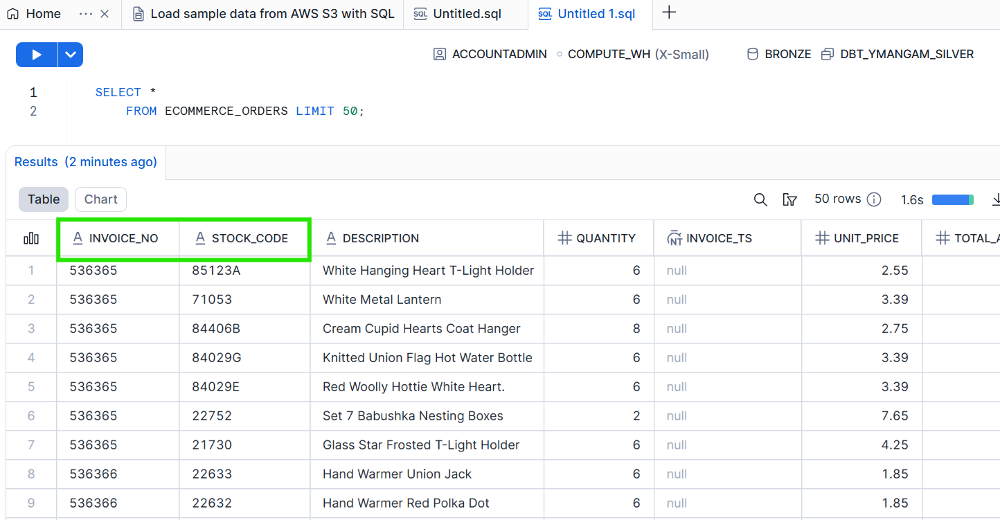
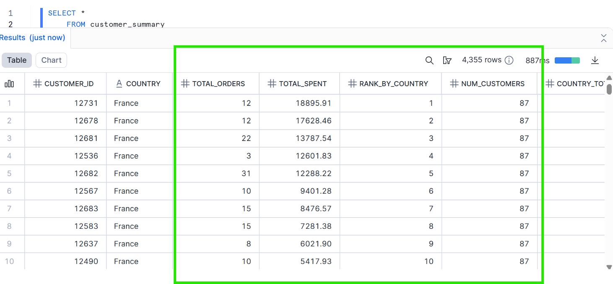

This project demonstrates an **end-to-end ELT workflow** using **dbt Cloud** and **Snowflake**
# multi-layered ELT pipeline using dbt and Snowflake:

- **Bronze layer**: Raw, unprocessed data directly ingested from the source (in this case, a Kaggle online retail dataset). This layer preserves the original data for traceability and auditing.  
- **Silver layer**: Cleansed and validated data derived from Bronze. Here, transformations standardize fields, filter out invalid records, rename columns based on business needs and minimum data validations.  
- **Gold layer**: Aggregated, business-ready data built from the Silver layer. This layer is optimized for analytics, dashboards, and reporting, providing insights such as customer-level metrics or sales trends.
---

## 📂 Project Overview

### Bronze Layer
- **Purpose:** Raw ingestion layer for traceability.
- **Source Table:** `"BRONZE"."PUBLIC"."ONLINEORDERS"` from Kaggle dataset.
- **Content:** All raw e-commerce transactions including InvoiceNo, StockCode, Description, Quantity, InvoiceDate, UnitPrice, CustomerID, and Country.

### Silver Layer
- **Purpose:** Cleaned and validated data ready for analytics.
- **Models:**
  1. **`silver.ecommerce_orders`**
     - Cleans raw online orders by removing negative quantities or prices.
     - Standardizes text fields (`Description`, `Country`) and computes `total_amount`.
  2. **`silver.customers`**
     - Aggregates orders at the customer level.
     - Computes metrics: `total_orders` and `total_spent` per customer.
- **Schema:** `SILVER`

### Gold Layer
- **Purpose:** Analytics-ready aggregated data.
- **Model:**
  1. **`gold.customer_summary`**
     - Combines customer-level metrics (`total_orders`, `total_spent`) and country-level metrics:
       - Number of customers per country
       - Total spend per country
       - Average spend per customer
     - Ranks customers within their country based on total spend.
- **Schema:** `GOLD`

---

## 🔗 Data Flow

```
Bronze (raw data)
      |
      v
Silver (cleaned & aggregated)
      |
      v
Gold (analytics-ready & aggregated)
```

---
##  How to Run

Run both silver models:

```bash
dbt run --select silver.ecommerce_orders silver.customers --no-partial-parse
```

List available models:

```bash
dbt ls --resource-type model
```

---

## 🧪 Add Description  (Optional)

Add simple data description in `models/silver/schema.yml`:

```yaml
version: 2

models:
  - name: ecommerce_orders
      description: "Silver Ecommerce orders table"
  - name: customers
      description: "Extracting Unique customers from Bronze layer "
```

Run tests:

```bash
dbt test --select silver
```
## 📊 Project Results

### Bronze Layer Example
.png)

### Silver Layer Example


### Gold Layer Example

---

## 📊 Potential Next work

- Create more Silver/ Gold tarnsformation based on requirement 
- Create PowerBI dashbords using **gold models** ( monthly sales trends).
- Schedule runs in dbt Cloud for automation.

---

## 👤 Author
Yogi Mangam

### Resources:
- Learn more about dbt [in the docs](https://docs.getdbt.com/docs/introduction)
- Check out [Discourse](https://discourse.getdbt.com/) for commonly asked questions and answers
- Join the [dbt community](https://getdbt.com/community) to learn from other analytics engineers
- Find [dbt events](https://events.getdbt.com) near you
- Check out [the blog](https://blog.getdbt.com/) for the latest news on dbt's development and best practices
